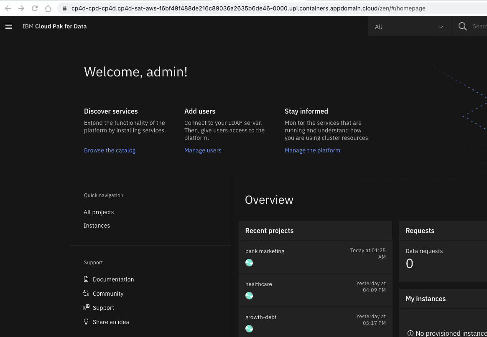
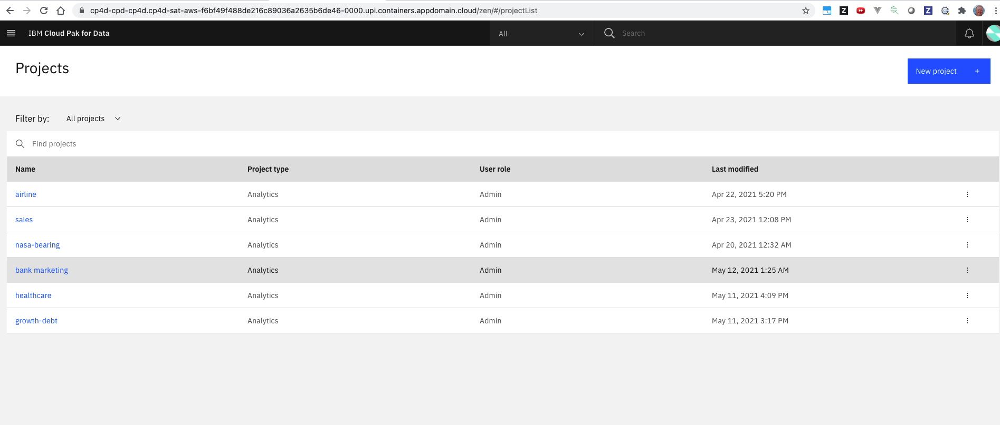
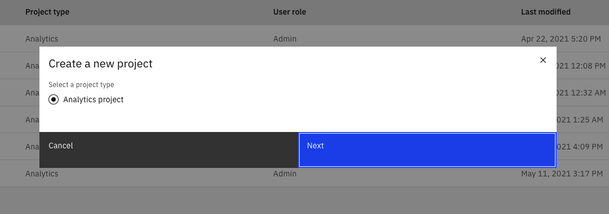
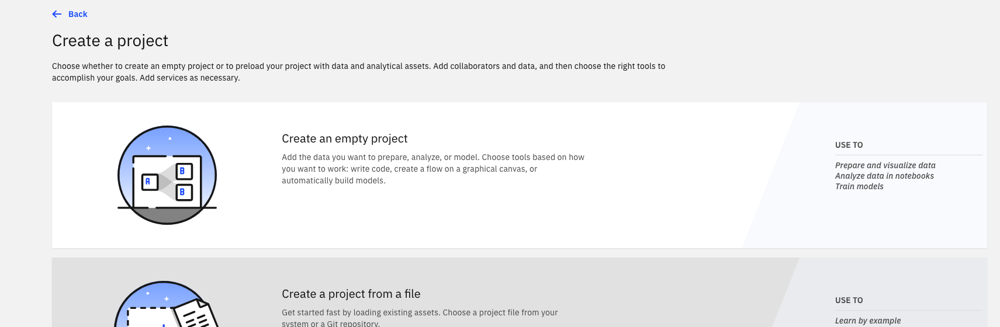
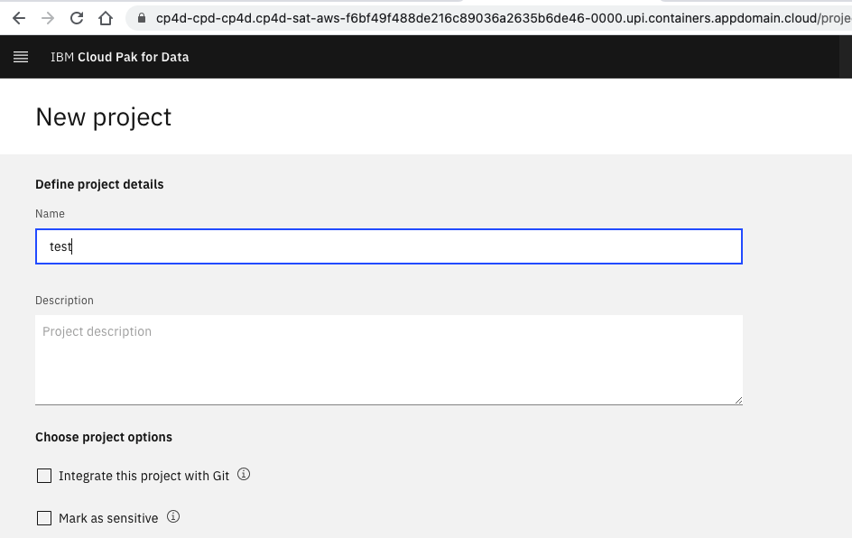
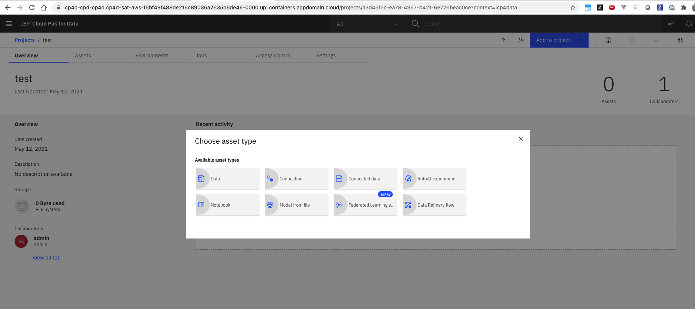
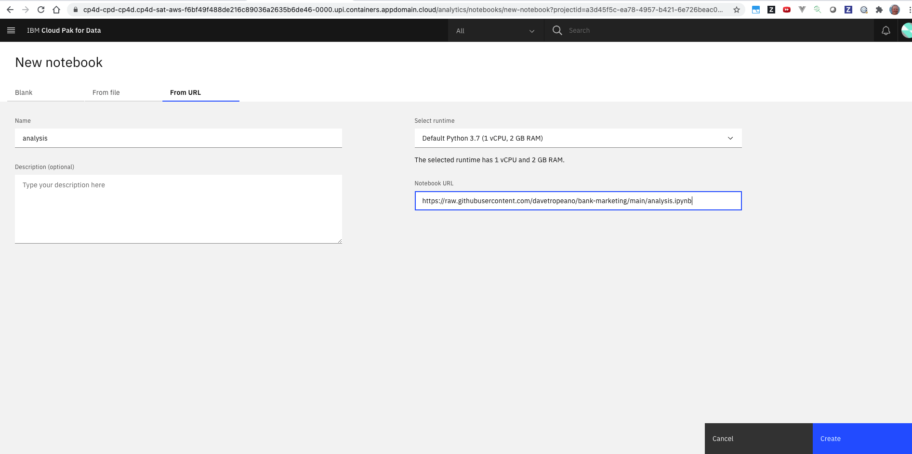
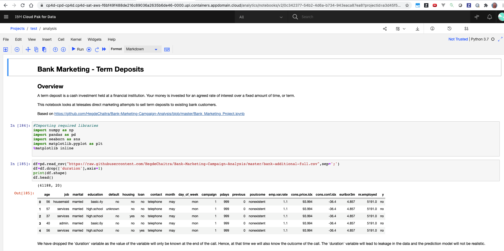

# Bank Marketing - Initial Data Analysis

1. From CP4D admin console click "All Projects"

2. click "New Project"

3. click "Next"

4. Create an empty project

5. Name the project

6. Click "Add to Project" and select "Notebook"

7. Click on the "From URL" tab, name the notebook "analysis" and use the URL https://raw.githubusercontent.com/davetropeano/bank-marketing/main/analysis.ipynb as the notebook source

8. The notebook loads. You can scroll through, execute the notebook fresh, etc.

